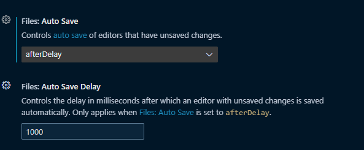
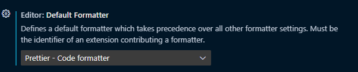
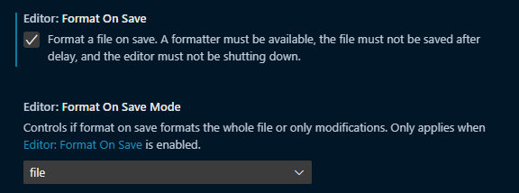

<p align="center">

</p>
<h1 align="center">Productive VS Code</h1>

# Customizing VS Code

## Change UI Theme

```html
https://marketplace.visualstudio.com/items?itemName=ThePsychoCoder.psyco-coder-dark
```

## Change Icon Theme

```html
https://marketplace.visualstudio.com/items?itemName=PKief.material-icon-theme
```

## Change Font Family

```html
https://www.jetbrains.com/lp/mono/
```

- Preview fonts online

```html
https://coding-fonts.netlify.app/fonts/codelia/
```

## Change Font Size

1. Press `Ctrl` + `Shift` + `P`, then search for `setting (UI)`.
2. Search `Font Size` and change according to your preference.

## Turn On Ligatures

1. Press `Ctrl` + `Shift` + `P`, then search for `setting (json)`.
2. Add this line.

```json
    "editor.fontLigatures": true
```

## Word Wrap

When any text runs off the side of the screen, the Word Wrap feature of VS Code consolidates it within the window and formats it perfectly.

1. Press `Ctrl` + `Shift` + `P`, then search for `setting (UI)`.
2. Search `editor word wrap` and turn it `on`.

## Editor Split

- Press `Ctrl` + `\`.

- Press `Ctrl` + `Shift` + `P`, then search for `split editor`.

# Editor

## Editor Preview Mode

When ever we single press to open a file in `VS Code`, it just shows us the `preview` of file until we type something in it.

One way to get rid out of this issue by opening file by double click.

Another way is to turn it `off` in settings.

- How we check the file is in `preview mode` or not?

> If the tab name is in `Italics`, then it is in `preview mode`, otherwise not.

## Trigger Intellisense

- Press `Ctrl` + `Space`

## Go To Definition

- Press `F12` or `right click` on mouse.
- Press `Ctrl` and click the `function`.

## Find

We can use regular expression `(regex)` to find something. Just press `alt` + `r` and press `ctrl` + `f` and write your expression.

## Multi Cursor Editing

Suppose, you are changing some repeated text one option you use is `find and replace`. Other option is, press `Ctrl` + `F` and write that text and then press `alt` + `enter`, now you have multi-line cursor and every keystroke you did can reflect to all cursor positions.

Alternatively, you can use `alt` + `mouse pointer` to the desired location to create multi-line cursor.

## Rename Symbol

Now, we are in a condition where we have to change the name of a function, one thing we can do is find and replace all but changes reflects to all the matching strings.

To solve this issue, there is an option in `VS Code`. Select the function name you want to change, press `right mouse key` and then select `Rename Symbol`. In this option, VS Code replaces all the function name everywhere it is called across the file system.

One more alternative way of doing this, we can select text and press `right mouse key` and select `Find All References`.

# Extensions

## Settings

### Disable Extensions

> More extensions -> slower the IDE.

Some project doesn't required all the extension we installed. So, we can disable them for particular workspace or project.

1. Press `Ctrl` + `Shift` + `X`.
2. Navigate to the plugin you want to disable.
3. Press the `gear` or `setting` icon.
4. Select `Disable For Workspace`.

### Recommended Extensions For Workspace

While working on a project, you installed some extensions. You want to recommended list of extension whoever use this project. One way is to list down all the extension and that use install them one by one.

Now, `VS Code` provides use a functionality by which, we can add recommended extension to the user using the project.

1. Press `Ctrl` + `Shift` + `P`.
2. Type `Recommended Extension` and select it.
3. Now, it will open a new file named `extension.json`.
4. In the `extension.json` file, you will find `recommendations` array.
5. After that, we just have to copy extension id from the extension page and paste in the array with double quotes.

Now, when ever someone open your project in `VS Code`, it will show a **pop-up** for _recommending extension_, which can be installed using one click.

### Setting Sync

Having multiple devices can be clutter when we have to modify setting in all the devices one-by-one. With the `sync setting` we can use `GitHub` or `Microsoft` account to sync setting across the devices.

- Press `Account` icon present in the _bottom-left_ corner. Add your account.

## Snippets

### Extension Based Snippets

1. Press `Ctrl` + `Shift` + `X` to open extension marketplace.
2. Write `@category:"snippets"` and this will show you all the available snippets extension.
3. Press `Ctrl` + `Shift` + `P` to open `Command Palette`.
4. Search `Insert Snippet` and select it.
5. It will show you all snippets and you can insert which one you want.

### User Defined Snippets

1. Press `Ctrl` + `Shift` + `P` to open `Command Palette`.
2. Search and select `Snippets: Configure User Snippets`.
3. Now, you have option to create snippet for any language, workspace or globally. Select any of these.
4. Enter the name of snippet.
5. Now, a new file created with the name of your snippet.
6. Here is an example:

```javascript
	"Print ctrl": {
		"scope": "markdown",
		"prefix": "ctrl",
		"body": [
			"`Ctrl` + $0"
		],
		"description": "Print the Ctrl Button in Markdown"
	}
```

7. Now, when ever you type the `{prefix}`, it will shows the option to select the snippet.

> Snippet guide available in the starting of your snippet file with an example.

### Open VS Code In A Folder

- Using Terminal

```bash
code folderName
```

- Using Context Menu

**One time setup**:

1. Press `Ctrl` + `Shift` + `P` to open the Command Palette.
2. Type `shell command` and select `Shell Command: Install 'code' command in PATH`.

This will add the code command to your system PATH, so that you can launch VS Code from anywhere on your computer by typing code in a terminal window.

Now, open desired folder you want to open in VS Code and press `right mouse` key, you will see `Open With Code` option there.

## Useful Extensions

### `Import Cost`

Display import/require package size in the editor.

<center>

</center>

### `Markdown All In One`

All you need to write Markdown (keyboard shortcuts, table of contents, auto preview and more).

### `markdownlint`

Markdown/CommonMark linting and style checking for Visual Studio Code.

## Git Extensions

### `gitignore`

This extension lets you pull `.gitignore` templates from `github/gitignore`.

1. Install extension `gitignore` from the marketplace .
2. Press `Ctrl` + `Shift` + `P`.
3. Search for `add gitignore`.
4. Now, you have to select the technology of your project.

### `Version Lens`

Shows the latest version for each package using code lens.

<center>

</center>

### `gitlink`

Goto/Copy current file's online link, supports multiple remote sources in GitHub/GitLab/BitBucket/VSTS/DevOps.

### `Git Indicators`

Git indicator in the status bar.

### `GitLens`

Supercharge Git and unlock untapped knowledge within your repository to better understand, write, and review code. Focus, collaborate, accelerate.

### `Dendron`

Dendron is an open-source, local-first, markdown-based, note-taking tool. It's a personal knowledge management solution (PKM) built specifically for developers and integrates natively with IDEs like VSCode.

## Multiple Projects Workflow

### `Project Manager`

It helps you to easily access your projects, no matter where they are located. Don't miss those important projects anymore. You can define your own Projects (also called Favorites), or choose for auto-detect Git, Mercurial or SVN repositories, VSCode folders, or any other folder.

### `Peacock`

Subtly change the workspace color of your workspace. Ideal when you have multiple VS Code instances and you want to quickly identify which is which.

# Autosave & Autoformat Workflow

## Auto Save

- Why?
  - Remove time to format.
  - Remove milliseconds of thought.
  - Focus on code.
  - Enforce styles across team.

1. Open `Settings (UI)`.
2. Search `Auto Save`.
3. Change `Files: Auto Save` to `afterDelay`.



Now, whenever you stop typing, `VS Code` will automatically save your file after `1000` milliseconds.

## Auto Format: `Prettier`

Prettier is an opinionated code formatter. It enforces a consistent style by parsing your code and re-printing it with its own rules that take the maximum line length into account, wrapping code when necessary.

Now, after installing this extension we have to manually select this extension to `Format Document` once.

1. Open `Setting UI`.
2. Search `Default Formatter`.
3. Select `Prettier`.



After this, we can automate auto formatting using `Setting (UI)`.

1. Open `Setting UI`.
2. Search `Format On Save`.
3. Check the box with title `Editor: Format On Save`.


